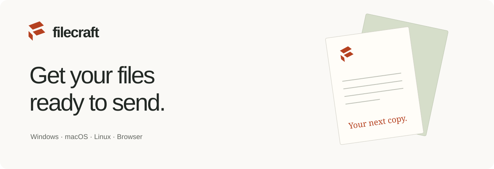
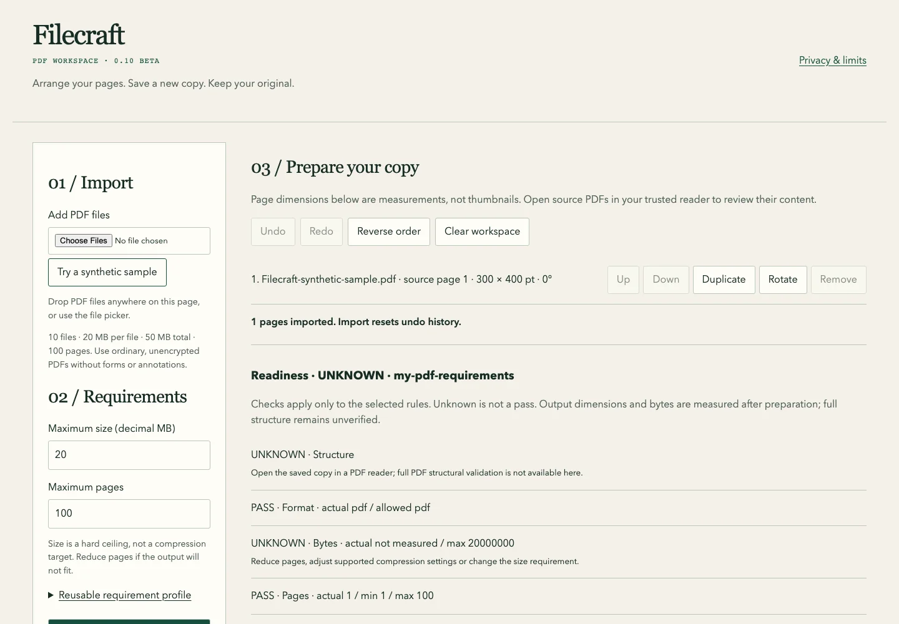

<p align="center">
  
</p>

<p align="center">
  <a href="https://filecraft.github.io/download/"><strong>Download</strong></a> ·
  <a href="https://filecraft.github.io/workspace/">Try in your browser</a> ·
  <a href="https://filecraft.github.io/documentation/">Documentation</a> ·
  <a href="https://filecraft.github.io/releases/">Release archive</a>
</p>
<p align="center">
  English · <a href="docs/i18n/README.fr.md">Français</a> · <a href="docs/i18n/README.es.md">Español</a>
</p>

# Filecraft

Prepare a PDF, resize an image, or save a document in another format. Work on a new copy and keep your original. Files stay on your device, with no account or document uploads.

## Start here

| Use Filecraft | Get it |
| :--- | :--- |
| Windows x64 | [Download 0.10 beta](https://github.com/Filecraft/Filecraft/releases/download/v0.10.0-beta.1/Filecraft-0.10.0-beta.1-desktop-windows-amd64.zip) |
| Mac or Linux | [Choose your computer](https://filecraft.github.io/download/) |
| Browser | [Open the PDF workspace](https://filecraft.github.io/workspace/) |
| Offline browser or extension | [Packages and installation](https://filecraft.github.io/download/) |

The current release is **0.10.0-beta.1**. Windows is unsigned; Mac apps are not notarized. Check the checksum, extract the full package, and follow your organization's security policy. Browser extensions are preview packages, not store listings.

## What it does

- **PDF pages:** combine files, reorder pages, rotate them, or remove the ones you do not need.
- **Images and documents:** resize images and convert supported formats in the desktop app. Office conversion focuses on text, not preserving complex layouts.
- **Size limits:** set a PDF byte limit. Desktop auto-fit tries the original, then structural compression. If neither meets your requirements, it stops.
- **Saved-copy checks:** keep a receipt and check whether the saved file's bytes have changed. A matching receipt is not proof of authenticity, safety or acceptance by a website.

OCR needs a local Tesseract installation. Media conversion needs FFmpeg. These tools are not downloaded automatically. [Full format support and limits](desktop/README.md).

<p align="center">
  <a href="https://filecraft.github.io/workspace/">
    
  </a>
</p>

## A quick example

Set a 2,000,000-byte ceiling for a separate PDF copy:

```sh
Filecraft-Desktop prepare input.pdf --target pdf --output fitted.pdf --max-bytes 2000000 --auto-fit
```

Auto-fit does not rasterize pages or promise to fit every PDF. [How it works](docs/AUTO-FIT.md).

## Run from source

Python 3.13 with Tk installed:

```sh
python3 -m venv .venv
.venv/bin/python -m pip install -r desktop/requirements.txt
.venv/bin/python desktop/launch.py
```

On Windows, use `.venv\Scripts\python.exe` instead of `.venv/bin/python`.

<details>
<summary>Tests and extension packaging</summary>

```sh
PYTHONPATH=desktop .venv/bin/python -m unittest discover -s desktop/tests -v
npm --prefix portable ci
npm --prefix portable test
python3 extension/package.py
```

</details>

## Help and contribute

[Report a bug](https://github.com/Filecraft/Filecraft/issues/new/choose) · [Contribution guide](CONTRIBUTING.md) · [Architecture](docs/ENGINE-ARCHITECTURE.md) · [Security](SECURITY.md) · [AI contribution rules](AGENTS.md)

Share a small synthetic example when reporting a problem, not a passport, application or other private document.

## AI assistance

Filecraft was developed with AI assistance. The maintainer identifies the model as OpenAI's frontier model GPT-6 Astra and supplied an estimated cost of **$256.09**. The supplied token counts conflict and have not been audited. [Full disclosure and exact figures](docs/AI-DISCLOSURE.md).

This describes development. Filecraft does not include a hosted neural-processing service.

## License

Current original source is [Apache-2.0](LICENSE). Dependencies keep their own licenses and notices. Filecraft was previously called Prepare; historical releases retain their original names and terms. [Migration notes](docs/MIGRATION.md).
