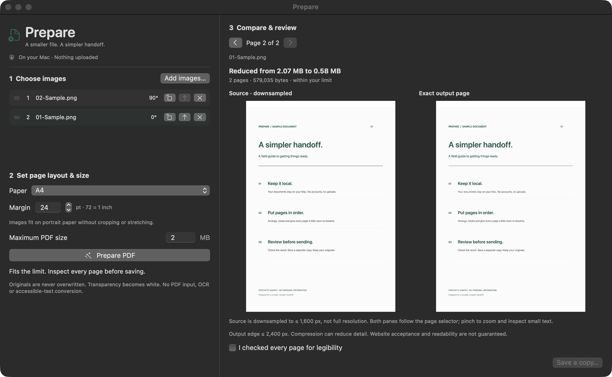

<div align="center">
  
  <h1>Prepare</h1>
  <p><strong>A smaller file. A simpler handoff.</strong></p>
  <p>Scans and photos → a size-constrained PDF. Entirely on your device.</p>
  <p>
    <a href="https://gonisulaimann.github.io/">Website</a> ·
    <a href="https://gonisulaimann.github.io/download/">Download</a> ·
    <a href="CONTRIBUTING.md">Contribute</a>
  </p>
  <p>
    <a href="https://github.com/gonisulaimann/Prepare/actions/workflows/ci.yml"></a>
    
    <a href="https://github.com/gonisulaimann/Prepare/actions/workflows/portable.yml"></a>
    <a href="https://github.com/gonisulaimann/Prepare/actions/workflows/android.yml"></a>
    <a href="https://github.com/gonisulaimann/Prepare/actions/workflows/engine.yml"></a>
    <a href="LICENSE"></a>
  </p>
</div>

An application portal says “2 MB maximum.” Your scans say otherwise.
Prepare turns up to 20 images into one ordered, reviewed PDF under your chosen
byte limit—or tells you when it cannot fit within its quality floor.

No account. No uploads. No analytics. No subscription. No AI service.
Native Apple frameworks on Mac; local HTML/JavaScript in an existing desktop
browser on Windows/Linux. The image companion has no runtime libraries; PDF
operations bundle pdf-lib. Android is a separate native engineering target.



## Desktop suite — 0.8.0-beta.1 released

[Download the desktop beta](https://github.com/gonisulaimann/Prepare/releases/tag/v0.8.0-beta.1) (28–51 MB). The larger [Desktop suite](desktop/README.md) adds native Windows/Linux/macOS
controls, format-aware output dropdowns, separate-process PDF previews, broader
image/text conversions and lossless ZIP/GZ compression for arbitrary extensions.
Local PDF operations include password handling, OCR, form filling and notes as
qualified in the desktop test suite. OCR and media conversion require locally
installed Tesseract/FFmpeg; no cloud fallback or automatic engine downloads.

This is a separate package from the tiny stable image converter. It is not an
all-extension converter or a sanitizer. See its explicit conversion and loss
matrix before using it. Existing stable and browser releases are unchanged.

## PDF workflows — 0.7.0-beta.1

A separate offline [PDF Workbench](workbench/README.txt) and [PDF CLI](pdf/README.md)
now copy real PDF pages: merge, extract, reorder, duplicate and rotate while
retaining text/vector content. The browser and Node tool share the same local
adapter, bundling MIT-licensed pdf-lib with its attribution. No runtime package
install or document upload is required. The CLI requires Node 22+ separately.

Use ordinary unencrypted PDFs without forms, annotations or signatures.
A byte ceiling rejects oversize output; this is not a compression engine.
Output is parsed again and geometry checked, but visual review and full PDF
conformance remain unverified. These are beta tools, not new native binaries.
The stable image converters and prior releases remain available unchanged.

[Download and platform prerequisites](https://gonisulaimann.github.io/download/)

## What makes the Mac app useful

- **A real byte budget.** Set 0.01–100 decimal MB. The finished PDF, not a size
  estimate, must fit before Prepare offers it for export.
- **Useful starting points.** Portal 500 KB, Application 2 MB with A4/24 pt
  margins, and Photo 10 MB. All remain editable.
- **Three compression profiles.** Balanced, Small File and true Grayscale.
  Source comparison retains original color.
- **Batch controls.** Natural filename sort, reverse order, rotate all and
  confirmed clear, without losing the selected page.
- **Pages in your order.** Drag to reorder or use move buttons. Rotate each
  page in 90° steps after the image's EXIF orientation is applied.
- **Paper that suits the handoff.** Image-aspect, A4 and US Letter layouts,
  with custom margins in points. Aspect-fit content, not accidental cropping.
- **Review before you send.** Page-by-page source-versus-output comparison.
  The source preview is downsampled; the output is the actual generated PDF.
- **Originals stay original.** Save a separate copy. Existing destination
  files are rejected, including the source images.
- **Metadata stays behind.** Source metadata dictionaries, including EXIF/GPS,
  are not copied. Transparency is flattened onto white.
- **Bounded work.** Serial image buffers, bounded decode sizes, at most five encoding
  attempts, progress reporting and cooperative cancellation.

The stable converter remains focused on image-to-PDF preparation. The next-generation
readiness engine and bounded PDF page adapter expand the architecture; arbitrary
PDF editing, interactive forms and full format certification are not supported.

## Readiness foundation — 0.6 beta

A dependency-free [shared engine and CLI](engine/README.md) now evaluates versioned
offline profiles, produces pass/fail/unknown checks, and runs bounded reversible
page-model workflows. Portable uses that same engine for undo/redo and JSON
profile import/export. Native converters are not yet migrated to it.

With Node 22+ installed: `node engine/cli.js inspect "scan.png"`. No npm install.
The CLI inspects headers and hashes bytes; it does not decode images or certify
PDF structure. Workflow commands edit a model, not a PDF file. Unknown evidence
is never silently promoted to READY. See [engine architecture](docs/ENGINE-ARCHITECTURE.md),
[product stages](docs/PRODUCT-ROADMAP.md), and [identity research](docs/IDENTITY-RESEARCH.md).

## Platform matrix — stable v0.5.0

| Platform | Artifact | Scope |
|---|---|---|
| macOS 14+, Apple Silicon | Native app ZIP | DPI ceilings, duplicate and move-to-last controls; ad-hoc signed, not notarized |
| Windows | Portable ZIP | Existing current desktop Chrome/Edge/Firefox; not an EXE |
| Linux | Same Portable ZIP | Existing current desktop Chrome/Firefox; not an ELF/package |
| Android | Experimental native source / unsigned APK build | Not installable until owner-signed; [verification gates](android/README.md) |

[Download v0.5.0](https://github.com/gonisulaimann/Prepare/releases/tag/v0.5.0).
Extract the whole Portable ZIP and open `Prepare-Portable/index.html`. No server
or internet is needed after download. JPEG/PNG, custom 36–600 DPI (0 automatic),
A4/Letter/margins, spread splitting, duplicate/remove/rotate pages and opt-in
near-white threshold cleanup. Cleanup may erase faint detail: review every page.
This is not semantic background segmentation. No OCR, PDF input or encryption.

Source EXIF/GPS metadata is not copied. Metadata retention controls and password
protection are roadmap items, not shipped features. Browser previews show embedded
images, not an independent PDF render; inspect output in a PDF reader. Use a trusted
browser and local storage; browser extensions, OS backup/sync and cloud-backed
file providers are outside Prepare's privacy boundary.

[100-capability architecture backlog](docs/ROADMAP-100.md) ·
[First-person governance](GOVERNANCE.md) · [Store foundations](distribution/README.md).
A roadmap entry or store config is not a supported feature or approved listing.

## Download and install

[Download Prepare 0.5.0 for Apple Silicon](https://github.com/gonisulaimann/Prepare/releases/download/v0.5.0/Prepare-0.5.0-arm64.zip)

Requires macOS 14 or later. Expand the ZIP and drag `Prepare.app` to Applications.
Intel and universal release binaries are not provided or release-tested.

> **Signing:** this release is ad-hoc signed, **not Developer ID signed or
> notarized**, and not sandboxed. macOS may block first launch. Review the
> source and checksum before deciding whether to approve it under System
> Settings → Privacy & Security after attempting to open it. Do not disable
> Gatekeeper globally. Managed Macs may disallow this build.

Verify a download in the directory containing both release assets:

```sh
shasum -a 256 -c Prepare-0.5.0-arm64.zip.sha256
```

The checksum detects accidental corruption; it is not an independent publisher
identity proof. You can build locally instead. No Developer ID certificate is
needed for a local ad-hoc build.

Downloading and using Prepare is subject to the [Hippocratic License 3.0 core](LICENSE).

## How to use the Mac app

1. Add or drop JPEG, PNG or HEIC still images, or use Finder **Open With → Prepare**.
2. Pick a workflow preset or customize the compression profile, byte limit,
   paper and margins. Arrange pages individually or use batch actions.
3. Enter your maximum PDF size and choose **Prepare PDF**.
4. Inspect each output page, using comparison mode when useful. Changing any
   layout, order or compression setting invalidates the previous result.
5. Acknowledge that you reviewed the output, then save to a new filename.

MB means 1,000,000 bytes. “Original” page size means the image's aspect ratio
with a maximum 10-inch page edge, not its embedded DPI or original physical
size. A4 and US Letter use portrait paper. Margins are points (72 per inch).

Keyboard shortcuts: ⌘O add images, ⌘R prepare, ⌘[ / ⌘] previous/next page,
⇧⌘S save a copy, Escape cancel active preparation.

## Mac limits

| Boundary | Behavior |
| --- | --- |
| Inputs | 1–20 single-frame JPEG, PNG or HEIC images |
| Per-file limit | 40 MB, 80 megapixels, at most 20,000 px per dimension |
| Existing PDFs / animation | Rejected; never silently rasterized or truncated |
| Compression | Lossy JPEG and possible downsampling; legibility is not guaranteed |
| Impossible budget | Explicit failure, never an oversized “success” |
| Source comparison | Downsampled preview, not a pixel-identical quality measurement |
| Output | Raster PDF, without OCR text or tagged accessibility structure |
| Cancellation | Between image operations; cannot interrupt Apple's codec mid-call |
| Privacy | Visible personal data and standard PDF producer/date metadata may remain |

The app has no networking code. Files selected from a syncing folder can still
sync through that provider. Prepare is not an anonymizer, redaction tool or
secure-erasure utility. Read the complete [security and privacy policy](SECURITY.md).

The v0.5.0 Apple Silicon ZIP is 682,160 bytes; installed app files total
1,607,206 bytes. Portable is 17,173 bytes compressed. System frameworks and the Swift toolchain are excluded.
See [v0.5 verification](docs/VERIFICATION-0.5.md) and
[domain findings](docs/DOMAIN.md).

## Build the Mac app from source

Requires macOS 14+ and Swift 6 (Xcode command-line tools). No third-party Swift
packages, cloud credentials or web build tools are needed for the app. Apple’s
Swift toolchain is a separate, much larger download if it is not installed.
Use the shallow clone below to avoid downloading release history.

```sh
git clone --depth 1 https://github.com/gonisulaimann/Prepare.git
cd Prepare
swift run Prepare
```

Build the distributable bundle and checksum:

```sh
bash scripts/package.sh
open build/Prepare.app
```

Outputs: `build/Prepare.app`, `build/Prepare-0.5.0-arm64.zip` and its `.sha256`
(on an Apple Silicon build host). The package includes the full license,
notice and original app icon. Packaging uses an ad-hoc signature by default.

## Test

```sh
swift run PrepareChecks --ui-contract
swift run -c release PrepareChecks --ui-contract
swift build -c release -Xswiftc -warnings-as-errors
swift run -c release PrepareChecks --stress
python3 scripts/check-site.py
node scripts/test-site.cjs
python3 scripts/test_release_budget.py
```

`PrepareChecks` is an executable integration harness, not an XCTest target.
It generates synthetic images locally and checks actual PDF bytes, reopened
pages, rendered pixels, input rejection, original-file protection, metadata
stripping and cancellation. `--stress` exercises repeated 20-page batches.

See [verification results](docs/VERIFICATION.md) for the measured release run
and its hardware/workload limits. There are no unsupported “instant” or
universal performance promises here.

## Website and documentation

The official site is https://gonisulaimann.github.io/.
[Browsable documentation](https://gonisulaimann.github.io/documentation/) and
website sources are maintained in the dedicated
[site repository](https://github.com/gonisulaimann/gonisulaimann.github.io).
Application release assets remain in this repository.

## Project map

```text
Sources/Prepare/        SwiftUI workspace and PDFKit review
Sources/PrepareCore/    Validation, ordering, presets, profiles and bounded PDF encoding
Sources/PrepareWorkspace/ Testable main-actor state and bounded preview coordination
Sources/PrepareChecks/ Synthetic integration and regression checks
scripts/               App packaging, icon generation and website checks
docs/                  Legacy site redirect and historical technical docs
.github/               macOS CI, issue forms and pull-request checklist
```

[Architecture](docs/ARCHITECTURE.md) · [Release checklist](docs/RELEASING.md) ·
[Changelog](CHANGELOG.md) · [Acknowledgments](docs/ACKNOWLEDGMENTS.md)

## Contribute

Start with [CONTRIBUTING.md](CONTRIBUTING.md). Focused fixes, accessibility
feedback and testing on supported Macs are especially useful. Keep everything
local. Use synthetic samples in issues. Substantial AI assistance should be
disclosed; contributors remain responsible for understanding and verifying
all submitted code.

Maintained by [Goni Sulaiman](https://github.com/gonisulaimann). Participation
follows our [code of conduct](CODE_OF_CONDUCT.md). Please use
[private vulnerability reporting](https://github.com/gonisulaimann/Prepare/security/advisories/new)
for security issues.

## License

Copyright © 2026 Goni Sulaiman and Prepare contributors.

**Hippocratic License 3.0, core configuration, no optional modules.** Read
[LICENSE](LICENSE) and [NOTICE](NOTICE). This is ethical-source,
source-available software: the license restricts harmful uses and is **not
an OSI-approved open-source license**. The first public release replaces the
unpublished prototype's MIT notice at the project owner's direction.

### Android experimental download

[Unsigned APK and checksum](https://github.com/gonisulaimann/Prepare/releases/tag/v0.5.0-android-experimental.1)
(24,796 bytes). Native Java, Android 9+; no network permission. API 28/36 emulator
regressions pass. Not tap-to-install: developers must sign their own copy.
Production signing, physical-device/SAF qualification and store submission remain
pending. Read [Android verification](android/VERIFICATION.md) before use.
